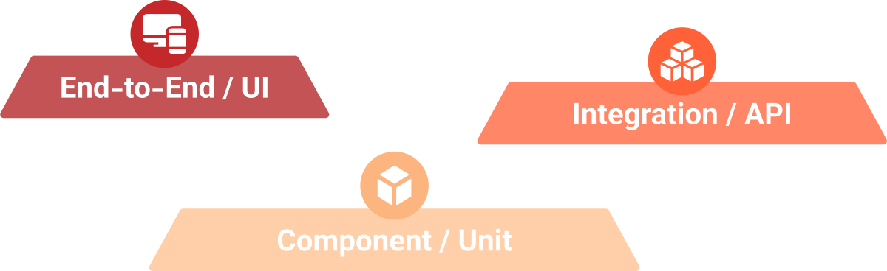
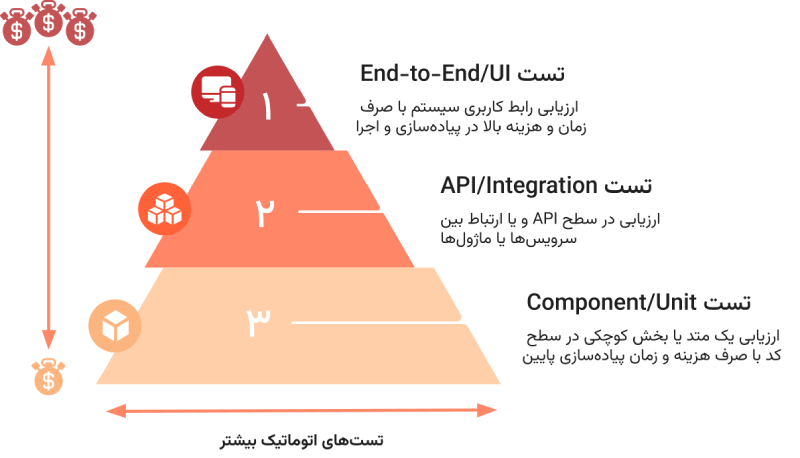

## ارزیابی بهتر و سریعتر با خودکارسازی
اساس کار یک سیستم مبتنی بر agile تولید پیوسته و رشد محصول به صورت افزایشی می‌باشد. محصولی که در ابتدا قابلیت‌های اندکی داشته طی چرخه‌های پیوسته بزرگتر و قابلیت‌های آن بیشتر می‌گردد. در این روند سریع، ارزیابی محصول نیز باید با سرعت بیشتری انجام گیرد تا افزایش فرکانس تولید خروجی باعث افت کیفیت محصول نگردد. در چنین شرایطی استفاده از مفهوم تست رگرسیون (Regression Testing) و اتوماتیک سازی روند تست کارگشا می‌باشد.
## مفهوم تست رگرسیون
در هر چرخه رشد محصول، علاوه بر ویژگی اضافه شده، ویژگی‌های دیگر که قبلا توسعه داده‌ شده‌اند نیز باید بررسی گردند تا از تاثیرات جانبی یک ویژگی بر روی محصول اجتناب گردد. به این نوع ارزیابی تست رگرسیون گفته می‌شود.
فرآیند آزمون و سنجش کیفی در صورت رشد سیستم در طول زمان، بزرگتر و پرهزینه‌تر می‌گردد. طی پروسه ارزیابی رگرسیون در صورت استفاده از تست به صورت Manual هزینه‌ آزمون افزایش پیدا کرده و روند آن فرسایشی می‌گردد. راه‌حل،‌ پیاده‌سازی تست‌ها در قالب اسکریپت‌هایی می‌باشد تا بتوان به صورت اتوماتیک و با سرعت به مراتب بیشتر نسبت به روند Manual‌ سیستم را ارزیابی نمود و عملا مفهوم تست رگرسیون را در یک چرخه agile تحقق بخشید.
اما فرآیند اتوماتیک‌سازی ممکن است در طول زمان شما را با چالش‌هایی مواجه کند. انتخاب ابزار نامناسب و عدم استفاده از الگو‌ یا چارچوب‌های مشخص می‌تواند نگهداشت اسکریپت‌های تست را با مشکل مواجه کند و در برخی شرایط عملا پرهزینه‌تر و غیرکاربردی‌تر از تست Manual گردد.
## سطوح تست محصول

 پیاده‌سازی اسکریپ‌های اتوماتیک می‌تواند در سطوح مختلفی انجام گیرد که از تکنولوژی، ابزار و تکنیک‌های متفاوتی در هر سطح استفاده می‌گردد. به صورت کلی می‌توان سطوح زیر را برای ارزیابی یک محصول بیان‌ نمود:
* **سطح End-to-End / UI:** در این سطح به محصول به صورت کلی نگاه شده و سناریو‌های مختلف در سطح رابط کاربری و همانند روندی که کاربر طی می‌کند بررسی می‌گردد. ابزارهای مورد استفاده در این سطح `Selenium, Appium, Test Complete` می‌باشد.
* **سطح Integration / API:** این سطح به بررسی صحت عملکرد ارتباط بین ماژول‌های داخلی یک محصول با یکدیگر می‌پردازد. به عنوان نمونه ارتباط یک سرویس با پایگاه‌داده یا ارتباط سرویس‌های مختلف در یک سیستم مبتنی بر میکروسرویس. معمولا در فریمورک‌های مختلف ابزاری را برای ارزیابی در این سطح در اختیار برنامه‌نویس قرار می‌دهند مانند `Spring Boot Test` در فریمورک مبتنی بر Spring، البته در یک سیستم میکروسرویس می‌توان با استفاده از ابزار `Postman` و یا `JMeter` در سطح API نیز ارتباط بین میکروسرویس‌ها را مورد ارزیابی قرار داد.

::: info
برای اطلاعات بیشتر از نحوه کار با ابزار Postman به مقاله [لینک](https://#) و نحوه کار با ابزار JMeter به مقاله [لینک](https://#) مراجعه نمایید. 
:::

* **سطح Component / Unit:** این سطح یک ماژول به عنوان یک بخش مستقل مورد ارزیابی قرار می‌گیرد و تنها عملکرد آن بخش مورد نظر می‌باشد. به عنوان نمونه یک تابع یا یک متد توسط برنامه‌نویس با پارامتر‌های مختلف بررسی می‌گردد. در این سطح از ابزار‌های مختلفی مانند `JUnit, TestNG` استفاده می‌گردد. همچنین در سیستم‌های میکروسرویس‌، هر سرویس به صورت مستقل بررسی و ارزیابی می‌گردد.

## هرم تست اتوماتیک
در هر سطح از محصول به چه میزان تست اتوماتیک مورد نیاز است؟ با توجه به تکنولوژی و ابزار‌های مختلف اشاره شده در سطوح تست محصول، پیاده‌سازی و اجرای تست با صرف زمان و هزینه‌های متفاوتی در هر سطح انجام می‌گیرد. هرم تست اتوماتیک استانداردی را برای هر سطح بیان می‌کند.

طبق این هرم بیشتر اسکریپت‌های تست می‌بایست در سطح Unit یا Component باشند و سطوح بالاتر نیز به ترتیب سهم کمتری از اسکریپت‌ها را دارا می‌باشند. هر چه به کف هرم نزدیک می‌شویم هزینه پیاده‌سازی و زمان اجرا تست‌ها کاهش‌ می‌یابد و عملا می‌توان Coverage‌ خوبی بر روی قابلیت‌های سیستم دارا بود. زیرا هر Unit توسط برنامه‌نویس که مسلط به قابلیت پیاده‌سازی شده بررسی شده و همچنین به دلیل کوچک بودن محدوده آزمون تعداد حالات بیشتری صحت‌سنجی می‌گردد. ارزیابی سطوح بعدی به خصوص UI بسیار پرهزینه و زمان‌بر خواهد بود زیرا تمامی محصول باید در محیط آزمون استقرار یابد و سیستم با در نظر گرفتن شرایط کاربر نهایی ارزیابی گردد.
توجه به همه این نکات به شما کمک خواهد کرد با هزینه‌ای منطقی، قابلیت اطمینان محصول افزایش پیدا کرده و بتوانید با فرکانس بیشتر و ریسک کمتر محصول خود را توسعه دهید. 

## نتیجه‌گیری
در انتها باید به این نکته تاکید نمود که اتوماتیک‌سازی روال ارزیابی، می‌بایست مبتنی بر استاندارد‌ها و چاچوب‌های مشخصی باشد و بدون در نظر گرفتن آن‌ها، روند تست اتوماتیک می‌تواند با سربار زیادی از نظر هزینه و زمان همراه باشد و پروسه نگهداشت سنگینی را به تیم توسعه تحمیل سازد. 

::: info
برای آشنایی با فرآیند درخواست سرویس به بخش [نحوه کار]($PAGES_URL/how-to-use) و برای شروع درخواست به صفحه [تماس با ما]($PAGES_URL/contact-us) مراجعه کنید.
:::

