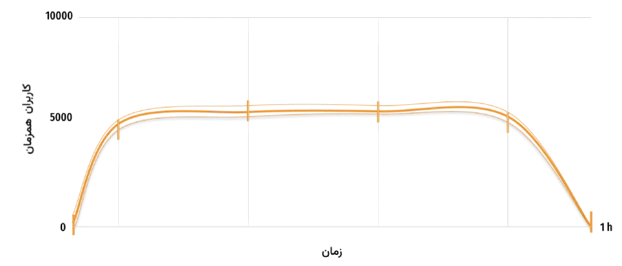

## چرا تست کارایی مورد نیاز شماست
شرایطی را فرض کنید که محصول نرم‌افزاری شما تمامی قابلیت‌های مورد انتظار را دارا می‌باشد اما بعد از استقرار در محیط عملیاتی یا تحویل به مشتری متوجه می‌شوید پس از گذشت زمان دچار اختلالاتی می‌گردد یا با افزایش تعداد کاربران عملکرد معمول خود را از دست می‌دهد. اگر محصول شما نتواند به صورت پایدار و کارا عمل کند تمامی قابلیت‌های توسعه داده شده در زمان اجرا بلا استفاده خواهند بود. راه‌حل این مشکلات بررسی محصول با استفاده از مکانیزم‌های ارزیابی کارایی می‌باشد.
تست کارایی یا performance به مجموعه‌ای از تست‌ها گفته می‌شود که وظیفه ارزیابی سیستم با شرایطی شبیه به محیط واقعی و عملیاتی از نظر کاربر، منابع و زمان را دارند تا این اطمینان حاصل گردد که سیستم در زمان تحویل به مشتری یا استقرار به صورت عملیاتی، مشکلاتی از قبیل عدم پشتیبانی از کاربران با تعداد زیاد یا پایداری را ندارد. اما انواع تست کارایی چیست؟ و کدام تست برای محصول شما مورد نیاز است؟

## تست بار (load)

<picture>
  <source media="(prefers-color-scheme: dark)" srcset="./resources/load-test-dark.webp">
  
</picture>

 این تست به منظور ارزیابی سیستم با شرایط و متغیر‌هایی نزدیک محیط عملیاتی در مدت زمان ۳۰ تا ۶۰ دقیقه انجام می‌گیرد. به عنوان مثال بر اساس ارزیابی‌های انجام شده سیستم باید بتواند تعاملات ۵۰۰۰ کاربر همزمان را پشتیبانی نماید. به منظور پیاده‌سازی تست بار، مشابه حالت ذکر شده شبیه‌سازی گردیده و بار مورد نظر بر روی سیستم تزریق می‌گردد.

::: warning
تست بار مهمترین و پایه‌ای ترین تست کارایی می‌باشد که می‌بایست برای هر محصولی پیاده‌سازی و اجرایی گردد.
:::
## تست استرس (stress)

 در این آزمون، سیستم با شرایطی بیش از ظرفیت ارزیابی شده برای تست بار مورد سنجش قرار می‌گیرد. میزان افزایش بار تا زمان استخراج توان بهینه و حداکثر توان عملیاتی سیستم ادامه می‌یابد. به عنوان نمونه حالت توان معمول سیستم بر اساس تست بار ۳۰۰۰ کاربر همزمان می‌باشد. آزمون استرس بر اساس ۱۰۰۰۰ کاربر همزمان طراحی و اجرا می‌گردد که طی آن مشخص می‌گردد سیستم کارایی خود را با جه تعداد کاربر همزمان از دست داده و دچار خطا می‌گردد. 
## تست ضربه (spike, peak)

 این آزمون با استفاده از افزایش ناگهانی حجم کاربران یا ورودی‌های سیستم انجام می پذیرد. هدف این آزمون بررسی رفتار سیستم پس از هر پیک می‌باشد و سیستم باید بتواند بعد از هر افزایش بار و برگشت به حالت عادی به روند طبیعی خود ادامه دهد. به عنوان نمونه سیستم با ورودی ۳۰۰۰ کاربر همزمان که حد معمول آن می‌باشد در حال ارزیابی بوده و در مقطعی از زمان تعداد کاربران همزمان به ۱۰۰۰۰ که چند برابر ظرفیت آن می‌باشد می‌رسد و سپس به سرعت به روند معمول باز می‌گردد. سیستم در چنین شرایطی می‌بایست در مقطعی دچار اختلال یا افزایش زمان دسترسی گردد و سپس به حالت عادی خود بازگردد.
## تست پایداری (endurance, stability)

 تست پایداری به منظور بررسی سیستم با شرایط مشابه محیط عملیاتی مانند تست load‌ اما در زمانی طولانی‌تری پیاده‌سازی می‌گردد. در این تست متغیر اصلی زمان است و می‌بایست وضعیت محصول  در مدت بیشتری ارزیابی گردد تا مشکلاتی از قبیل نشت حافظه یا عدم استفاده بهینه از منابع شناسایی گردند. به عنوان نمونه ۵۰۰۰ کاربر در حال تعامل با سیستم به مدت چند روز یا چند هفته می‌باشند. البته باید در نظر داشت به منظور اطمینان از این موضوع که سیستم طی مدت طولانی مثلا ۱ سال دچار مشکل نمی‌گردد، نمی‌توان این آزمون را برای ۱ سال اجرایی نمود ولی با یک ضریب می‌توان اطمینان پیدا کرد سیستم پایداری مطلوبی دارد. به عنوان نمونه می‌توان سیستم را با شرایط بار معمول ۵۰۰۰ کاربر همزمان طی یک هفته ارزیابی نمود و طی این زمان، میزان مصرف حافظه، میزان سوکت‌های شبکه و کانکشن به پایگاه‌داده می‌بایست روند مشخص و مورد انتظاری را طی کنند.

::: info
برای آشنایی با فرآیند درخواست سرویس به بخش [نحوه کار]($PAGES_URL/how-to-use) و برای شروع درخواست به صفحه [تماس با ما]($PAGES_URL/contact-us) مراجعه کنید.
:::
